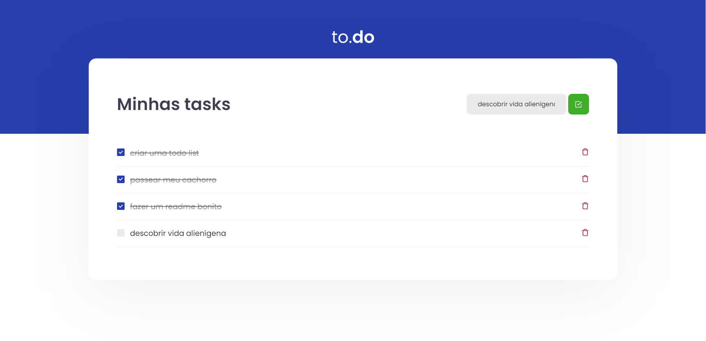

<h1
    style="
        font-weight: 600;
        "
    align="center"
>
    Desafio 01 Ignite - ReactJS - Conceitos React
</h1>

<h1 align="center">
    <a href="https://pt-br.reactjs.org/">🔗 React</a>
</h1>

<p align="center">Desafio de criação de uma todo list para aprender e aplicar os conceitos do React.</p>

<p align="center">
 <a href="#objetivo">Objetivo</a> •
 <a href="#rapp">Rodando a aplicação</a> •
 <a href="#tecnologias">Tecnologias</a> •  
 <a href="#autor">Autor</a>
</p>

<h3 align="center"> 
	✅ Desafio completado! ✅
</h4>

<br>

<h2 align="center">
  
</h2>

<h2 id="objetivo"> 🎯 Objetivo </h2>

Aperfeiçoar conhecimentos do React, trabalhando em conjunto do Typescript para uma aplicação consistente e moderna.

<br>

<h2 id="rapp"> 👨‍💻 Rodando a aplicação </h2>

Antes de começar, você vai precisar ter instalado em sua máquina as seguintes ferramentas:
[Git](https://git-scm.com), [Node.js](https://nodejs.org/en/), [Yarn](https://yarnpkg.com). 
Além disto é bom ter um editor para trabalhar com o código como [VSCode](https://code.visualstudio.com/)

### 🎲 Iniciando o site

```bash
# Clone este repositório
$ git clone <https://github.com/Casali-Code/01-ignite-react-desafio-conceitos-do-react.git>

# Acesse a pasta do projeto no terminal/cmd
$ cd 01-ignite-react-desafio-conceitos-do-react

# Instale as dependências
$ yarn

# Execute a aplicação em modo de desenvolvimento
$ yarn dev

# O servidor inciará na porta:8080 - acesse <http://localhost:8080>
```

<h2 id="tecnologias"> 🛠️ Tecnologias </h2>

As seguintes ferramentas foram usadas na construção do projeto:

- [React](https://pt-br.reactjs.org/)
- [TypeScript](https://www.typescriptlang.org/)

<br>

<h2 id="autor"> 🙋‍♂️ Autor </h2>
---

<a href="https://blog.rocketseat.com.br/author/thiago/">
 
 <br />
 <sub margin="0 auto"><b>Guilherme Casali</b></sub></a>


Feito com ❤️ por Guilherme Casali 👋🏽 Entre em contato!

[](https://www.linkedin.com/in/guilhermecasali/) 
[](mailto:guilhermecasali23@gmail.com)